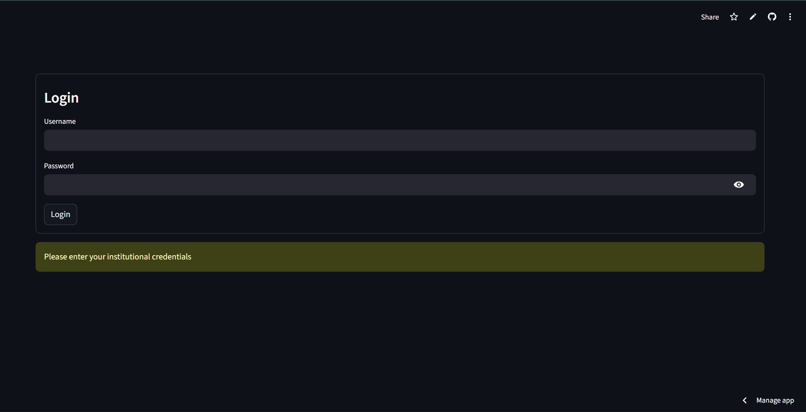
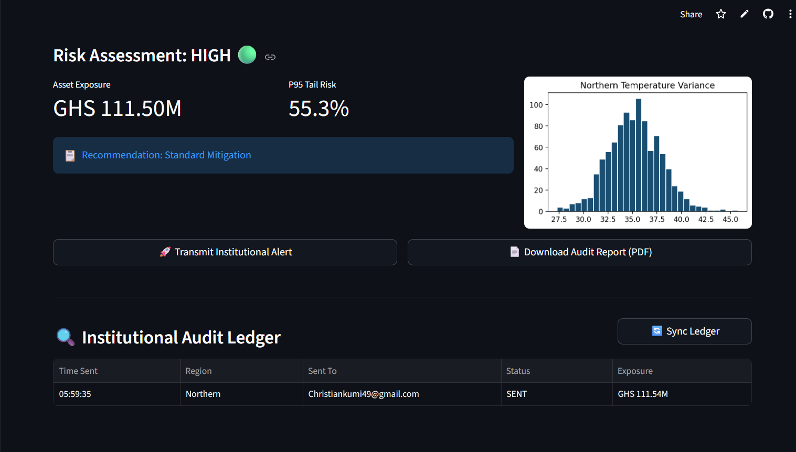
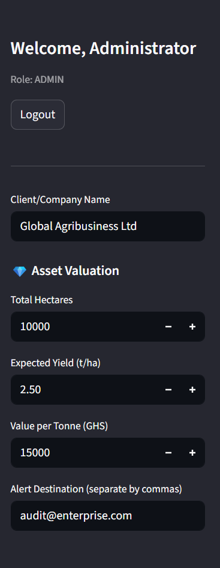
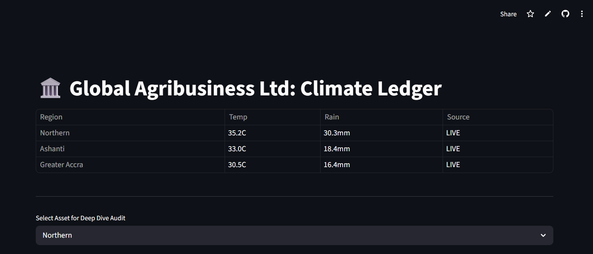

🌍 Climate Risk Intelligence System
An enterprise-grade platform that converts real-time weather data into financial risk insights for agribusiness and institutional decision-makers.
Helps organizations anticipate climate-driven losses and make faster, data-backed financial decisions.
🚀 Key Capabilities
Predictive Analytics: Estimates agricultural yield loss by modeling regional responses to temperature and rainfall fluctuations.

Stochastic Risk Modeling: Employs Monte Carlo Simulations to quantify uncertainty, providing both median exposure (P50) and extreme tail risk (P95).

Institutional Audit Ledger: A persistent SQL-based tracking system that logs all dispatched alerts for transparency and compliance.

Real-Time Alerts: Dispatches automated risk triggers via a secure background SMTP protocol to multiple stakeholders.

Professional Reporting: Generates structured, confidential PDF audit reports for decision-support and mitigation planning.
## 📸 System Preview

### 🔐 Secure Authentication
Built with enterprise-grade authentication to protect sensitive institutional climate data and regional risk reports.

  

### 📊 Risk Analytics & Financial Exposure
Advanced modeling of P95 tail risk and asset exposure using real-time meteorological inputs for the Ghanaian agribusiness sector.

  

### ⚙️ Precision Valuation Controls
Granular control over asset parameters including total hectares, expected yield, and market valuation per tonne.

  

### 📜 Institutional Audit Ledger
A synchronized record of all transmitted alerts and financial risk audits, ensuring transparency and accountability.

  

🧠 How It Works
Data Ingestion: Fetches live localized weather parameters (maximum temperature and cumulative precipitation) via the Open-Meteo API.

Regional Logic: Applies regression-based coefficients tailored to specific Ghanaian agro-ecological zones (e.g., Northern, Ashanti, and Greater Accra).

Simulation Layer: Executes 1,000+ stochastic iterations to model yield variance based on historical atmospheric deviations.

Financial Quantification: Translates biological yield loss into GHS exposure based on custom asset valuation (Hectares × Yield × Market Price).

Audit Persistence: Automatically migrates and updates the ledger to reflect the transmission status ("SENT" or "FAILED") and recipient details.

🛠️ Tech Stack
Frontend: Streamlit (Dashboard UI)

Data Science: NumPy, Pandas, Matplotlib (Monte Carlo simulations & visualization)

Database: SQLite (SQL persistence for audit logs)

Authentication: streamlit-authenticator (Secure access control for Admins vs. Viewers)

Protocols: SMTP (Secure email dispatch), FPDF (Automated PDF generation)

💼 Institutional Use Cases
Agribusiness: Proactive crop risk monitoring and irrigation deployment planning.

Lending Institutions: Assessing climate-based credit risk for agricultural loans.

Insurance: Quantifying regional exposure for climate-indexed insurance pricing.

Climate Research: Analyzing the financial impact of regional climate variability and Monsoon patterns.

👨‍💻 Author
Christian Kumi
BSc Meteorology & Climate Science — Kwame Nkrumah University of Science and Technology (KNUST)

Building solutions at the intersection of Atmospheric Dynamics, Data Science, and Agro-Finance.

🌐 Live Application
👉 [https://agri-climate-ledger.streamlit.app/]

⚠️ Disclaimer
This system is a decision-support tool based on statistical regression models and available meteorological data. It is intended for analytical purposes and does not guarantee exact biological or financial outcomes.
